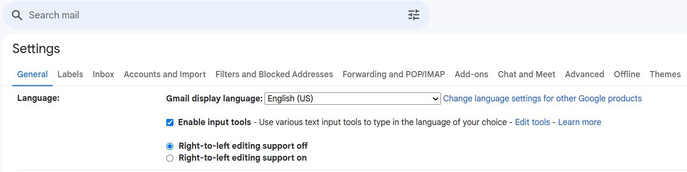

Prerequisites
-------------

Before running the case study, ensure you have the following tools installed:

- Python 3.10 or higher
- PyCharm Community Edition (or any other code editor)
- Linux (Ubuntu 22.04), or Windows (optional with WSL)
- Firefox Browser (Version 119.0.1, 64-bit or higher)

Getting Started
---------------

1. Set up Gmail display language to English (US).

2. Clone repository playwright_test_email to your local machine.

3. Create a virtual environment.
   
    .. code:: text

        python -m venv .venv

4. Activate the virtual environment.
    - Git Bash (Windows)
    
    .. code:: text

        source .venv/Scripts/activate

    - Linux/MacOS

    .. code:: text

        source .venv/bin/activate    

5. Install the required dependencies.

    .. code:: text

        pip install -r requirements.txt

6. Download the necessary browser binaries (Chromium, Firefox, and WebKit) required by Playwright by following command:

    .. code:: text

        playwright install        

6. Into a `config.env <../../config.env>`_ file in the root directory add the password instead of **** for the email account.

    .. code:: text

        PASSWORD=your_password

7. In the `*.feature <../../bdd_tests/features>`_ files, please fill out 'Examples:' tables with Gmail 
   credentials (eamil, account_name) and account information (name_from_contacts, email_address_from_contacts)
   from contacts list where test email should be sent.  The email account's password 
   needs to be entered as described in the step number six above.        

.. warning::

    Protect your password and credentials!

    **Do not share credentials or passwords through any repository. Always ensure that before sharing your code or committing changes, 
    all credentials are removed from 'Examples:' tables within feature files and also from config.env file.
    Protect your sensitive information and avoid sharing it inadvertently.**
 
.. note::

    The optimal choice is to include your personal email account in the contacts and enter it into the 'Examples:' 
    tables to avoid sending unsolicited emails to someone else's account.**

8. Execute the test cases by command below.

    .. code:: text

        pytest bdd_tests/login_logout.py && pytest bdd_tests/send_email.py

            

